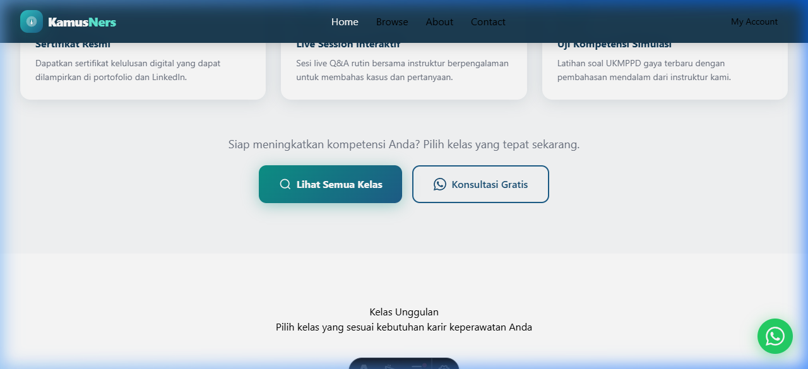

# 🩺 KamusNers — Platform Kelas Online Premium untuk Perawat

<div align="center">



**Platform belajar online terpercaya untuk perawat Indonesia**

[](https://astro.build)
[](https://tailwindcss.com)
[](https://vercel.com)
[](https://mayar.id)
[](./LICENSE)

> 🏆 **Project Lomba Mayar 2026** — Submitted by **Teuku Vaickal**

</div>

---

## 📋 Table of Contents

- [Overview](#-overview)
- [Features](#-features)
- [Tech Stack](#-tech-stack)
- [Project Structure](#-project-structure)
- [Getting Started](#-getting-started)
- [Environment Variables](#-environment-variables)
- [Mayar Integration](#-mayar-integration)
- [Deployment](#-deployment)
- [Scripts](#-scripts)
- [Coding Guidelines](#-coding-guidelines)
- [Author](#-author)

---

## 🌟 Overview

**KamusNers** adalah platform kelas online premium yang dirancang khusus untuk perawat (Ners) Indonesia. Platform ini mengintegrasikan sistem pembayaran [Mayar.id](https://mayar.id) untuk manajemen transaksi dan akses kelas secara otomatis.

Platform ini dibangun sebagai submission untuk **Lomba Mayar 2026** dengan tujuan mendemonstrasikan integrasi penuh Mayar.id API termasuk Direct Checkout, Embed Checkout, dan Webhook untuk verifikasi pembayaran.

### Kenapa KamusNers?

- 🎓 **Relevan** — Kurikulum berbasis SKKNI & standar kompetensi Ners terkini
- 📱 **Aksesibel** — Belajar kapan saja, di mana saja dari perangkat apa pun  
- 🔐 **Terpercaya** — Pembayaran aman melalui Mayar.id dengan enkripsi penuh
- 🏆 **Bersertifikat** — Sertifikat digital setelah menyelesaikan setiap kelas

---

## ✨ Features

| Feature | Status | Description |
|---------|--------|-------------|
| Halaman Beranda | ✅ | Hero section, statistik, fitur unggulan, testimoni |
| Browse Kelas | ✅ | Filter kelas per kategori dengan 9 kelas tersedia |
| Detail & Checkout | ✅ | Integrasi langsung ke Mayar Direct Checkout |
| Halaman About | ✅ | Visi, misi, nilai, dan profil tim instruktur |
| Halaman Kontak | ✅ | Form kontak + info kontak + FAQ |
| My Account | ✅ | Panduan akses Mayar Customer Portal |
| Webhook Handler | ✅ | Verifikasi pembayaran HMAC-SHA256 |
| Responsive Design | ✅ | Mobile-first, optimal di semua ukuran layar |
| SEO Optimized | ✅ | Meta tags, Open Graph, Canonical URL |
| Dark Header | ✅ | Navbar glassmorphism dengan scroll effect |
| AOS Animations | ✅ | Fade-in & slide-up animations on scroll |

---

## 🛠 Tech Stack

### Core

| Layer | Technology | Version |
|-------|-----------|---------|
| Framework | [Astro](https://astro.build) | `^5.x` |
| Styling | [Tailwind CSS](https://tailwindcss.com) | `^3.x` |
| Adapter | `@astrojs/vercel` | Latest |
| Language | TypeScript | `^5.x` |

### Integrations

| Service | Purpose |
|---------|---------|
| [Mayar.id](https://mayar.id) | Payment gateway & LMS (checkout, webhook, portal) |
| [AOS](https://michalsnik.github.io/aos/) | Animate On Scroll library |
| [Google Fonts](https://fonts.google.com) | Plus Jakarta Sans, Inter |

### Infrastructure

| Service | Purpose |
|---------|---------|
| [Vercel](https://vercel.com) | Hosting & CI/CD |
| GitHub | Source control |

---

## 📁 Project Structure

```
kamusners/
├── public/                     # Static assets
│   ├── logo.png                # Brand logo
│   ├── favicon.png             # Browser favicon
│   ├── hero.png                # Hero illustration (AI generated)
│   ├── founder.png             # Founder profile photo
│   └── courses/                # Course thumbnail images
│       ├── medikal-bedah.png
│       ├── kgd.png
│       ├── maternitas.png
│       ├── icu.png
│       ├── anak.png
│       ├── jiwa.png
│       ├── komunitas.png
│       ├── farmakologi.png
│       └── ukmppd.png
│
├── src/
│   ├── components/
│   │   ├── Navbar.astro        # Sticky header with glassmorphism
│   │   ├── Footer.astro        # Site footer
│   │   ├── CourseCard.astro    # Reusable course card component
│   │   └── WhatsAppButton.astro # Floating WhatsApp FAB
│   │
│   ├── layouts/
│   │   └── BaseLayout.astro    # Base HTML shell with SEO & AOS
│   │
│   ├── pages/
│   │   ├── index.astro         # Home page
│   │   ├── about.astro         # About page
│   │   ├── contact.astro       # Contact page
│   │   ├── account.astro       # My Account / Portal guide
│   │   ├── browse/
│   │   │   └── index.astro     # Course catalog with filtering
│   │   └── api/
│   │       └── webhook.ts      # Mayar payment webhook handler
│   │
│   └── styles/
│       └── global.css          # Global styles, Tailwind layers, utilities
│
├── .env                        # Environment variables (not committed)
├── .env.example                # Environment variables template
├── .gitignore
├── astro.config.mjs            # Astro configuration
├── tailwind.config.cjs         # Tailwind configuration
├── tsconfig.json               # TypeScript configuration
└── package.json
```

---

## 🚀 Getting Started

### Prerequisites

- **Node.js** `>= 18.x`
- **npm** `>= 9.x` or **pnpm** `>= 8.x`
- A [Mayar.id](https://mayar.id) account with active products

### Installation

```bash
# 1. Clone the repository
git clone https://github.com/teukuvaickal/kamusners.git
cd kamusners

# 2. Install dependencies
npm install

# 3. Copy environment template
cp .env.example .env

# 4. Fill in your environment variables (see section below)
# Edit .env with your actual keys

# 5. Start development server
npm run dev
```

The app will be available at **http://localhost:4321**

---

## 🔑 Environment Variables

Create a `.env` file in the project root. See `.env.example` for reference:

```env
# Mayar.id API Key (public, safe to expose in frontend)
PUBLIC_MAYAR_API_KEY=your_mayar_public_api_key_here

# Mayar Webhook Secret (private, server-side only)
MAYAR_WEBHOOK_SECRET=your_mayar_webhook_secret_here
```

> [!CAUTION]
> Never commit your `.env` file. The `.gitignore` already excludes it. Only `PUBLIC_MAYAR_API_KEY` is safe to expose on the client side. Keep `MAYAR_WEBHOOK_SECRET` strictly server-side.

---

## 💳 Mayar Integration

This project demonstrates three key Mayar.id integration patterns:

### 1. Direct Checkout Links

Each course card links directly to the Mayar checkout page:

```astro
<!-- In CourseCard.astro -->
<a href="https://mayar.id/checkout/{product-slug}" target="_blank">
  Daftar Sekarang
</a>
```

### 2. Checkout URL Format

```
https://mayar.id/checkout/{your-product-slug}
```

Replace `{your-product-slug}` in `src/pages/index.astro` and `src/pages/browse/index.astro` with your actual Mayar product slugs.

### 3. Webhook Handler

The webhook endpoint handles Mayar payment events with HMAC-SHA256 signature verification using the **Web Crypto API** (no Node.js `crypto` import needed — fully compatible with Astro SSR/Edge):

```
POST /api/webhook
```

**Supported events:**
- `payment.success` — Payment confirmed
- `payment.failed` — Payment failed
- `payment.expired` — Payment link expired

**Verify webhook signature:**
```
X-Mayar-Signature: <HMAC-SHA256 of raw body using your webhook secret>
```

### 4. Customer Portal

After successful payment, students access their courses via the Mayar Customer Portal:
```
https://mayar.id/customer
```

---

## 🌐 Deployment

### Vercel (Recommended)

This project is pre-configured for Vercel with SSR support:

```bash
# 1. Push to GitHub
git add .
git commit -m "feat: initial release"
git push origin main

# 2. Import project in Vercel dashboard
# https://vercel.com/new

# 3. Add environment variables in Vercel:
#    - PUBLIC_MAYAR_API_KEY
#    - MAYAR_WEBHOOK_SECRET

# 4. Deploy!
```

### Register Webhook in Mayar Dashboard

After deployment, register your webhook URL in the Mayar.id dashboard:

```
https://your-app.vercel.app/api/webhook
```

---

## 📜 Scripts

```bash
# Start development server
npm run dev

# Build for production
npm run build

# Preview production build locally
npm run preview

# Type check
npx astro check
```

---

## 📐 Coding Guidelines

This project follows **2026 Modern Web Standards**:

### General

- **TypeScript-first** — All logic files use strict TypeScript. Props interfaces defined for every component.
- **Component-driven** — UI broken into focused, reusable `.astro` components. No inline logic in pages where possible.
- **Server-side rendering** — Output mode `server` for dynamic API routes; pages that don't need SSR use `export const prerender = true`.
- **No client-side frameworks** — Vanilla JS only for interactivity. No React/Vue shipped to browser unnecessarily.

### Styling

- **Tailwind CSS** — Utility-first CSS. No custom CSS unless absolutely necessary (gradients, animations).
- **Design tokens** — Custom colors defined in `tailwind.config.cjs` (`primary`, `teal`, `accent`).
- **Component classes** — Reusable utility classes (`.btn-primary`, `.card`, `.badge-*`) defined in `@layer components` in `global.css`.
- **Inline styles only for gradients** — Background gradients use `style=` attribute to avoid Tailwind CSS purge issues with dynamic values.

### Performance

- **Static pre-rendering** — All non-dynamic pages use `prerender = true` for maximum CDN caching.
- **Lazy loading** — All images use `loading="lazy"` except the hero (above-fold).
- **Font loading** — Google Fonts loaded via CSS `@import` with `display=swap`.
- **AOS** — Animate On Scroll loaded via npm (not CDN) to avoid race conditions. CSS fallback ensures content is always visible if JS fails.

### Security

- **Webhook verification** — All Mayar webhook payloads verified with HMAC-SHA256 before processing.
- **Web Crypto API** — Uses native `crypto.subtle` instead of Node.js `crypto` module for edge runtime compatibility.
- **Environment separation** — `PUBLIC_` prefix for client-safe variables; server secrets never leak to the browser.

### Code Style

```
Indentation    : 2 spaces
Quotes         : Single quotes (TypeScript/JS), double quotes (HTML attributes)
Semicolons     : Yes (TypeScript)
Line length    : 100 chars max
Component naming : PascalCase (MyComponent.astro)
File naming      : kebab-case for pages (browse/index.astro)
Variable naming  : camelCase, descriptive (formattedPrice, not fp)
```

### Git Conventions

```
feat:     New feature
fix:      Bug fix
style:    Styling changes
refactor: Code refactoring (no behavior change)
docs:     Documentation
chore:    Build/config/tooling changes
```

---

## 👤 Author

<div align="center">

**Teuku Vaickal**

*🏆 Project Lomba Mayar 2026*

[](https://github.com/teukuvaickal)

</div>

---

## 📄 License

```
MIT License

Copyright (c) 2026 Teuku Vaickal

Permission is hereby granted, free of charge, to any person obtaining a copy
of this software and associated documentation files (the "Software"), to deal
in the Software without restriction, including without limitation the rights
to use, copy, modify, merge, publish, distribute, sublicense, and/or sell
copies of the Software, and to permit persons to whom the Software is
furnished to do so, subject to the following conditions:

The above copyright notice and this permission notice shall be included in all
copies or substantial portions of the Software.

THE SOFTWARE IS PROVIDED "AS IS", WITHOUT WARRANTY OF ANY KIND, EXPRESS OR
IMPLIED, INCLUDING BUT NOT LIMITED TO THE WARRANTIES OF MERCHANTABILITY,
FITNESS FOR A PARTICULAR PURPOSE AND NONINFRINGEMENT.
```

---

<div align="center">

Made with ❤️ for Indonesian Nurses · **KamusNers** © 2026

*Meningkatkan kompetensi perawat Indonesia satu kelas setiap harinya.*

</div>
